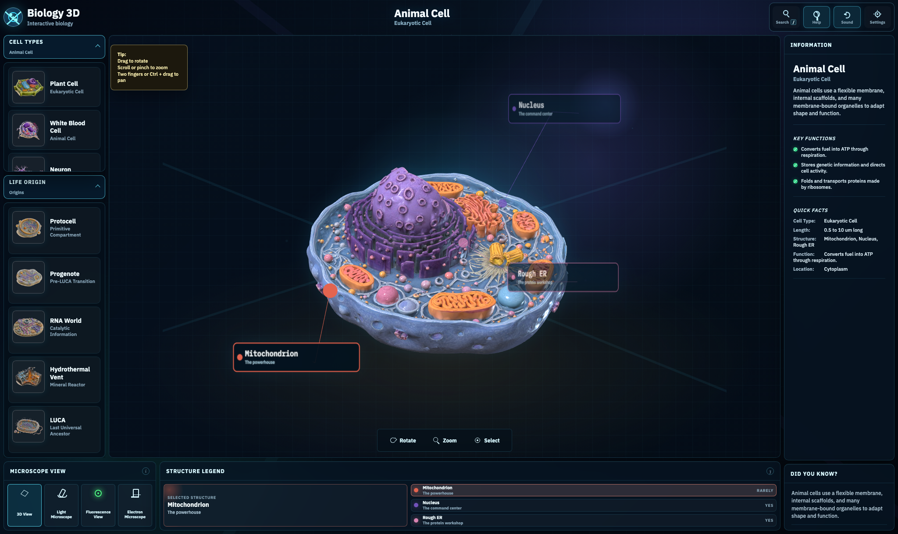

# Biology 3D

Interactive biology viewer for exploring cell types and early life-origin models in a 3D-style interface.

Live site: `https://biology-3d.vercel.app`



## What it includes

- Cell types and life-origin specimens in two separate left-rail dropdowns
- Global search in the top-right navigation with `/` keyboard shortcut
- Interactive structure callouts that drive the right-side info panel
- Structure legend selection synced with hover and click
- View mode controls, cross-section toggle, microscope strip, help, and sound
- Static asset delivery with Vercel deployment support

## Project structure

```text
.
├── index.html
├── styles.css
├── script.js
├── assets/
├── vendor/
└── scripts/
```

## Run locally

This project is a static site. The simplest local run is:

```bash
cd /Users/codyx/Code/med
python3 -m http.server 8000
```

Then open:

`http://localhost:8000`

## Deploy

Production is deployed on Vercel. From this folder:

```bash
vercel deploy --prod --scope codyxs-projects
```

## GitHub

Repository:

`https://github.com/codyx/biology-3d`

## Notes

- `.vercel/` is ignored and should stay local.
- Large binary assets live under `assets/`, so pushes and deploy uploads can take a while.
